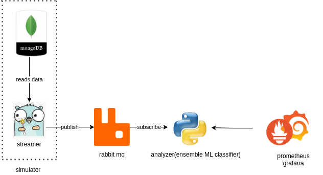
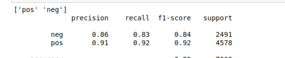

# Opinion minding service on a Persian dataset
The idea was proposed and implemented during two days in Snapp Hackton event. The output is a complete product capable of
doing opinion minding. **open source is holly**, so we're going to publish our experience with as much detail as we 
remember hoping to help anyone who may need it.

# Our current service design

This service can easily become real-time by adding a scrapper instead of the simulator which was not our goal in the MVP.

# Process
1. **Data**: In any ML project the first and most important factor is a rich dataset. The dataset can lead a project to 
   success or failure and that's where our trouble began finding a dataset in persian is not easy nor free. Our dataset 
   contained 21 thousand comments of people about different subjects like hotels and cellphone it also included some news, 
   so I think we were not bias on a single subject. We bought the dataset, so we are not allowed to publish it publicly 
   but in case you're doing a similar project email me for the dataset. 
   **flaws and challenges**: Your dataset should represent the real data you want to do prediction on. The data we used 
   to train our model with was so clean without any emojis or marks so was not a good representation. Pay attention that
   so many people comment ironically, so the words are nice, but the meaning is completely the opposite, your model should
   be complex enough to find the meaning in these cases.
   
2. **Model**: Once you have the data you can start implementing and training your model, you don't need to implement the model from 
   scratch, we used the code from [this famous repository](https://github.com/kk7nc/Text_Classification). 
   **flaws and challenges**: As far as I know one of the best models to use in opinion minding is conditional random fields,
   but it just doesn't work on Persian dataset cause [nltk](https://github.com/nltk/nltk) doesn't support Persian, and we 
   don't have such a power full library either, so we had to give up on that and train a simple SVM model (considering 
   tf-idf to reduce the weights of common words with no value). On the other hand we didn't have time to train another 
   model but never loose the profit of ensemble models. I should mention that we implemented an RNN model too but couldn't
   train it because the kernel of the jupyter notebook died.
   
3. **Software engineer**:

# Result
Here is the result on our test data.

